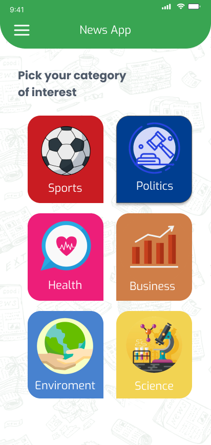
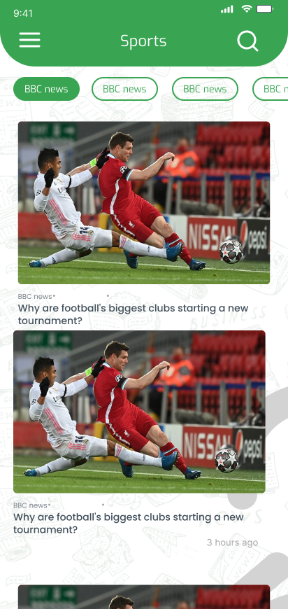

# Top News App

## 📑 Table of Contents

1. [🚀 Introduction](#-introduction)
2. [🛠 Installation & Setup](#-installation--setup)
3. [🤝 Contribution Guide](#-contribution-guide)
4. [🖥️ Technical Stack](#️-technical-stack)
5. [🎥 Demo Video](#-demo-video)
6. [🛠 Features](#-features)
6. [📷 Screenshots](#-screenshots)
7. [👥 Contributors](#-contributors)

## 🚀 Introduction

A modern news application built with Flutter implementing MVVM architecture. The app provides
real-time news updates with offline capabilities, multiple categories, and a responsive UI. Features
include offline caching of news articles and sources using Hive, infinite scroll pagination, and
multi-language support.

## 🛠 Installation & Setup

### Prerequisites

- **Flutter SDK**: Install Flutter SDK
  from [Flutter Official Website](https://flutter.dev/docs/get-started/install)
- **IDE**: Android Studio or VS Code with Flutter plugins
- **Device/Emulator**: Physical device or emulator for testing

### Steps

1. Clone the repository:
   ```bash
   git clone https://github.com/Mohammedhussein12/top_news_app.git
   cd news-app
   ```

2. Install dependencies:
   ```bash
   flutter pub get
   ```

3. Run the app:
   ```bash
   flutter run
   ```

## 🤝 Contribution Guide

1. Fork the repository
2. Create feature branch:
   ```bash
   git checkout -b feature-name
   ```
3. Commit changes:
   ```bash
   git commit -m "Add detailed commit message"
   ```
4. Push branch:
   ```bash
   git push origin feature-name
   ```
5. Open Pull Request

## 🖥️ Technical Stack

### Architecture & Design Pattern

- **MVVM (Model-View-ViewModel)** architecture
- Clean code principles
- Repository pattern for data management

### Core Technologies

- **Flutter**: Cross-platform UI framework
- **Dart**: Programming language

### State Management

- **flutter_bloc**: Advanced state management using BLoC pattern
- **provider**: Lightweight state management solution

### Data Persistence & Caching

- **hive**: Fast, lightweight database for offline storage
- **hive_flutter**: Flutter integration for Hive
- **shared_preferences**: Local key-value storage
- **cached_network_image**: Image caching and loading
- **path_provider**: File system path management

### Networking & Connectivity

- **http**: Network requests handling
- **connectivity_plus**: Network connectivity monitoring
- **url_launcher**: External URL handling
- **infinite_scroll_pagination**: Efficient list pagination

### UI Components & Styling

- **google_fonts**: Typography customization
- **font_awesome_flutter**: Extended icon set
- **flutter_native_splash**: Custom splash screen
- **cupertino_icons**: iOS-style icons

### Internationalization & Formatting

- **flutter_localization**: Multi-language support
- **intl**: Internationalization utilities
- **timeago**: Human-readable timestamps

## 🎥 Demo Video

Watch the demo video to see the application in action:
*
*[Demo Video Link](https://drive.google.com/file/d/156I4vvd5FepfNYdE5bWRQvJcqWwx-fGd/view?usp=drive_link)
**

## 🛠 Features

### 📰 News Feed

- Real-time news updates from reliable sources
- Infinite scroll with pagination
- Offline reading capability
- Time-based article sorting
- Rich media support with cached images

### 🔄 Offline Functionality

- Hive database integration for article storage
- Automatic syncing when online
- Cached images for offline viewing
- Persistent user preferences

### 🌐 Localization & Languages

- Multi-language support
- Dynamic locale switching
- RTL/LTR layout support
- Localized date and time formats

### 🔍 Categories & Navigation

- Sports coverage
- Health updates
- Business news
- Environmental news
- Scientific developments
- Category-based filtering

### ⚙️ Advanced Features

- Network connectivity monitoring
- Smart cache management
- External link handling
- Share functionality
- Dynamic theme support
- Custom error handling

### 📱 UI/UX Features

- Modern, clean interface
- Responsive design
- Custom fonts with Google Fonts
- Loading states and animations
- Pull-to-refresh functionality
- Error states handling
- Custom splash screen

## 📷 Screenshots

| Home                                 | Article Details View                               | articles                                       |
|--------------------------------------|--------------------------------------------|--------------------------------------------------|
|  |  |  |

| Settings                                     | Search                                   | Splash                                   |
|----------------------------------------------|------------------------------------------|------------------------------------------|
|  |  |  |

## 👥 Contributors

- **Mohammed Hussein** ([Mohammedhussein12](https://github.com/Mohammedhussein12))
